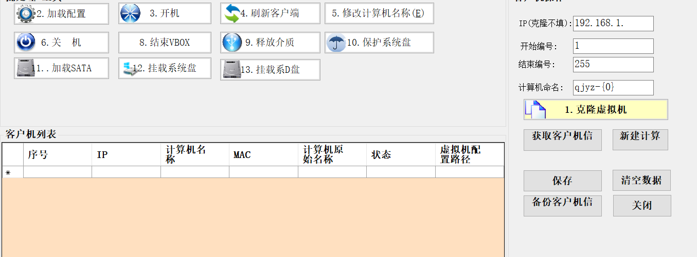

# 云计算批量部署工具

#### 介绍
{**以下是 Gitee 平台说明，您可以替换此简介**
Gitee 是 OSCHINA 推出的基于 Git 的代码托管平台（同时支持 SVN）。专为开发者提供稳定、高效、安全的云端软件开发协作平台
无论是个人、团队、或是企业，都能够用 Gitee 实现代码托管、项目管理、协作开发。企业项目请看 [https://gitee.com/enterprises](https://gitee.com/enterprises)}

#### 软件架构
​

一、批量创建云计算在教育行业优点
1. 快速部署：能够迅速创建大量相同配置的虚拟机，大大缩短了云教室环境的准备时间，快速满足教学需求。
2. 统一配置：确保所有虚拟机具有相同的软件、设置和环境，为学生提供一致的学习体验，减少因配置差异导致的问题。
3. 高效管理：方便管理员对虚拟机进行集中管理，如更新软件、安装补丁等操作，只需在一个模板虚拟机上进行，然后应用到克隆的虚拟机上。
4. 节省资源：通过克隆，避免了为每个虚拟机单独进行复杂的配置过程，提高了硬件资源的利用率。
5. 灵活扩展：可以根据学生数量的增加或课程需求的变化，快速批量增加虚拟机的数量，具有很强的扩展性。
6. 故障恢复：当个别虚拟机出现故障时，能够快速通过克隆替换，减少对教学的影响。
7. 成本效益：降低了云教室的建设和维护成本，提高了资源利用效率和投资回报率。
8. 实验环境搭建：便于为不同的课程或实验创建相同的初始环境，确保学生在相同条件下进行学习和实践。 

二、在政府办理窗口优点
1. 快速部署服务：能够迅速为新增的办理窗口创建相同配置的工作环境，快速投入使用，提高服务上线的效率。
2. 保证一致性：确保各个办理窗口的虚拟机配置一致，包括操作系统、应用软件和安全设置等，减少因环境差异导致的业务处理不一致或错误。
3. 简化管理：管理员可以对克隆的虚拟机进行统一的管理和维护，如软件更新、安全策略部署等，降低管理的复杂性。
4. 应急响应：当某个窗口的虚拟机出现故障时，能快速通过克隆替换，减少服务中断时间，保障业务的连续性。
5. 资源优化：避免为每个窗口单独配置复杂的环境，提高硬件资源的利用率，降低成本。
6. 灵活扩展：根据业务量的变化，快速增加或减少办理窗口的虚拟机数量，以适应工作需求的波动。
7. 测试与培训：方便创建用于测试新业务流程或培训新员工的虚拟机环境，且环境统一，便于评估和教学。
8. 安全保障：相同的安全配置有助于整体提升网络安全防护水平，降低因个别窗口配置不当导致的安全风险。

​

#### 安装教程

1.  xxxx
2.  xxxx
3.  xxxx

#### 使用说明

1.  xxxx
2.  xxxx
3.  xxxx

#### 参与贡献

1.  Fork 本仓库
2.  新建 Feat_xxx 分支
3.  提交代码
4.  新建 Pull Request

#### 特技

1.  使用 Readme\_XXX.md 来支持不同的语言，例如 Readme\_en.md, Readme\_zh.md
2.  Gitee 官方博客 [blog.gitee.com](https://blog.gitee.com)
3.  你可以 [https://gitee.com/explore](https://gitee.com/explore) 这个地址来了解 Gitee 上的优秀开源项目
4.  [GVP](https://gitee.com/gvp) 全称是 Gitee 最有价值开源项目，是综合评定出的优秀开源项目
5.  Gitee 官方提供的使用手册 [https://gitee.com/help](https://gitee.com/help)
6.  Gitee 封面人物是一档用来展示 Gitee 会员风采的栏目 [https://gitee.com/gitee-stars/](https://gitee.com/gitee-stars/)
